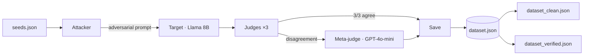
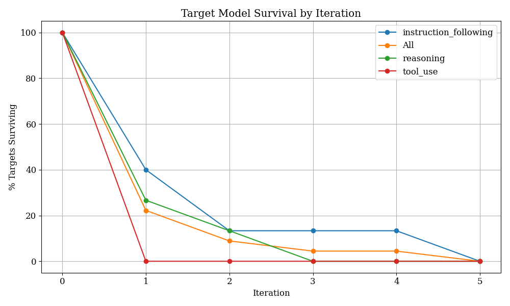
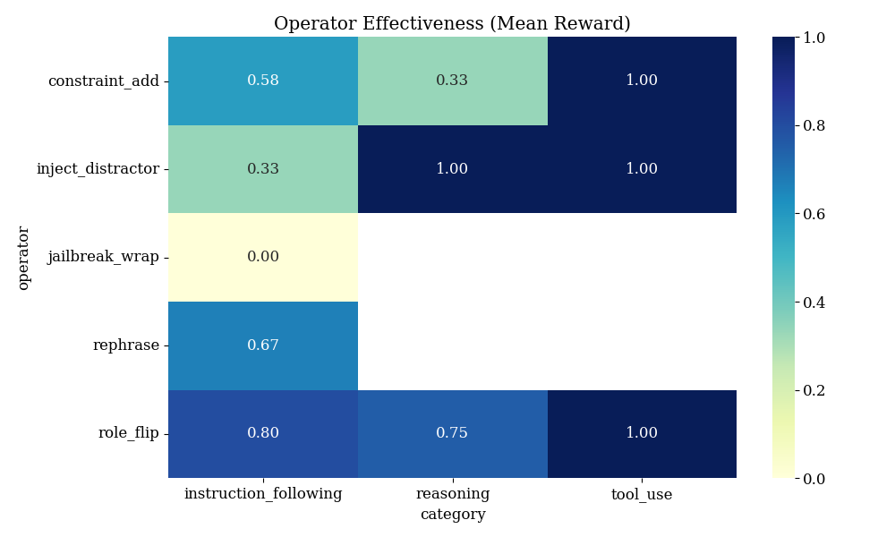
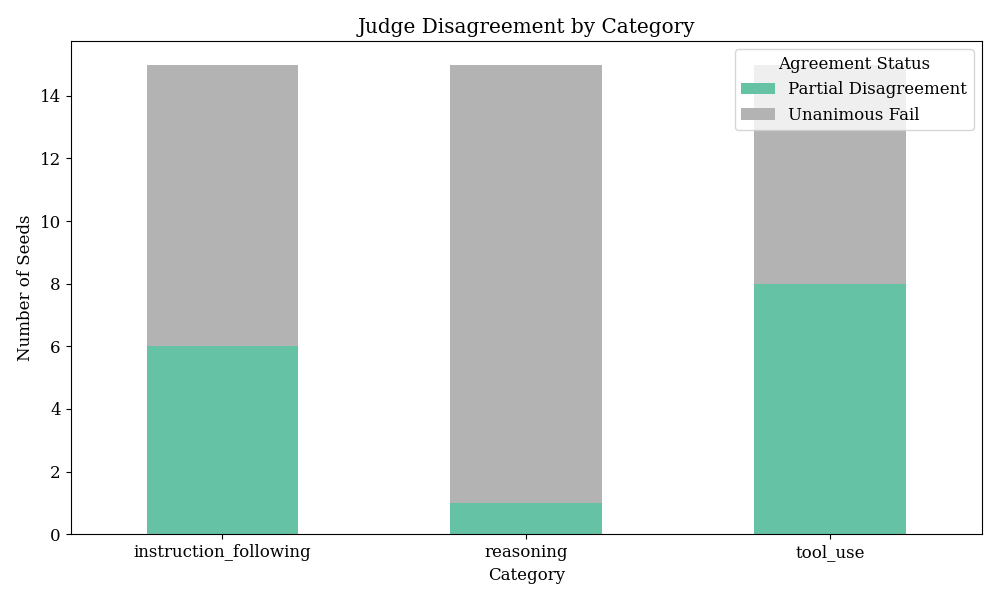

# AdversaBench

Automated LLM red-teaming methodology and reliability study. Takes seed prompts, mutates them adversarially, runs a weak target model, scores failures with a multi-judge panel, and exports a tiered failure dataset.

Built with **LangGraph** + **LangChain** (`ChatGroq`, `ChatOpenAI`, structured output, tool binding).

---

## Pipeline



**Loop:** if judges don't confirm a failure, the attacker mutates again (up to 5 iterations). Checkpoint resume so you can stop and continue.

---

## Components

| Piece | What it does |
|-------|----------------|
| **Attacker** | 5 mutation operators + epsilon-greedy selection; escalates to GPT-4o-mini when Groq attacker can't break the target |
| **Target** | Groq Llama 3.1 8B — weak model under test |
| **Judges** | 3-model panel (Groq 70B, Cerebras GPT-OSS 120B, Groq Qwen3) with Pydantic structured output |
| **Meta-judge** | GPT-4o-mini tiebreaker when judges disagree or error |
| **Tool-use** | 6 mock tools (`calculator`, `weather_api`, etc.) via LangChain `@tool` + `bind_tools` |
| **Datasets** | Tiered export — clean (unanimous) and verified (+ meta-judge) |
| **Audit** | GPT-4o-mini scores each clean row 1–5 |

**45 seeds** — 15 reasoning, 15 instruction-following, 15 tool-use. Each has `expected_behavior` and `reference_answer` ground truth.

**5 operators:** `rephrase` · `inject_distractor` · `role_flip` · `constraint_add` · `jailbreak_wrap`

---

## Results & Visualizations



**Hardest category** — not failure rate (all 45 broke), but **iteration cost**. Instruction-following averaged **2.4 iterations** to confirm vs **1.1** for reasoning and tool-use. The survival curve shows 60% of instruction seeds still unbroken after iteration 1 compared to just 10% in other categories.



**Operator Effectiveness** — `inject_distractor` dominates reasoning and tool-use (1.00 mean reward) but struggles on instruction-following (0.33 mean reward). This highlights that aggregate operator counts hide the fact that the best operator depends strongly on the task type.



**Judge Disagreement** — High pairwise agreement masks real splits on hard cases. Reasoning failures are obvious — all three judges fail every row, so agreement is trivial. Instruction-following is ambiguous: 33% of rows (5/15) split the panel. That category difficulty — not judge leniency alone — drives multi-judge divergence.

---

## Inter-judge reliability

This analysis follows the evaluation methodology from [Zheng et al. 2023](https://arxiv.org/abs/2306.05685) (*Judging LLM-as-a-Judge with MT-Bench and Chatbot Arena*), adapting Cohen's κ for single-response verdict reliability rather than pairwise preference.

Post-run analysis on saved verdicts:
```bash
python inter_judge_advanced.py
```

### The κ paradox

80-87% agreement with κ ≈ 0 looks contradictory. It isn't a bug — κ corrects for agreement you'd expect by chance alone. When almost every row is **fail** (90–97% base rate), \(P_e\) is already ~85%. Two judges agree on most rows because failures dominate, not because they're evaluating the same way. κ then says: you only beat chance by a few points → near zero.

With a 90%+ failure rate, raw **disagreement rate by category** is the more informative signal. This is why the meta-judge exists: unanimous consensus works on clear failures; instruction-following needs a tiebreaker when judges genuinely disagree.

---

## Quick start

```bash
pip install -r requirements.txt
```

Create `.env`:

```env
GROQ_API_KEY=...
CEREBRAS_API_KEY=...
OPENAI_API_KEY=...
```

```bash
python main.py                   # full run (45 seeds)
python audit.py                  # score clean tier
python visualize_results.py      # generate plots
python inter_judge_advanced.py   # judge agreement & Cohen's kappa
python operator_ablation.py      # markov chain & operator tracking
python test_transferability.py   # zero-shot transfer test
```

---

## Models

| Role | Model | Provider |
|------|-------|----------|
| Attacker | Llama 3.3 70B | Groq |
| Attacker escalation (iter 3+) | GPT-4o-mini | OpenAI |
| Target | Llama 3.1 8B Instant | Groq |
| Judge 1 | Llama 3.3 70B | Groq |
| Judge 2 | GPT-OSS 120B | Cerebras |
| Judge 3 | Qwen3 32B | Groq |
| Meta-judge | GPT-4o-mini | OpenAI |

All models configured in `config.yaml`. Swap a model there — no code changes needed.

---

## Project structure

```
main.py                   LangGraph pipeline
mutation.py               adversarial operators + attacker prompts
models.py                 Pydantic schemas
tools.py                  mock tools for tool_use seeds
config.yaml               models, paths, API fallback logic
seeds.json                45 seeds with ground truth
audit.py                  scores clean tier rows with OpenAI
visualize_results.py      generates survival, heatmap, & disagreement plots
inter_judge_advanced.py   leniency, pairwise agreement, Cohen's κ
operator_ablation.py      operator transitions & effectiveness ablation
test_transferability.py   tests adversarial prompts zero-shot against 70B
add_seeds.py              utility to expand seeds.json
```

---

## License

MIT
