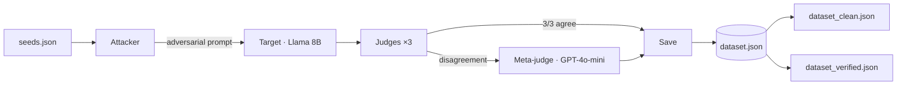

# AdversaBench

Automated LLM red-teaming benchmark. Takes seed prompts, mutates them adversarially, runs a weak target model, scores failures with a multi-judge panel, and exports a tiered failure dataset.

Built with **LangGraph** + **LangChain** (`ChatGroq`, `ChatOpenAI`, structured output, tool binding).

---

## Pipeline



**Loop:** if judges don't confirm a failure, the attacker mutates again (up to 5 iterations). Checkpoint resume so you can stop and continue.

---

## Components

| Piece | What it does |
|-------|----------------|
| **Attacker** | 5 mutation operators + epsilon-greedy selection; escalates to GPT-4o-mini when Groq attacker can't break the target |
| **Target** | Groq Llama 3.1 8B — weak model under test |
| **Judges** | 3-model panel (Groq 70B, Cerebras GPT-OSS 120B, Groq Qwen3) with Pydantic structured output |
| **Meta-judge** | GPT-4o-mini tiebreaker when judges disagree or error |
| **Tool-use** | 6 mock tools (`calculator`, `weather_api`, etc.) via LangChain `@tool` + `bind_tools` |
| **Datasets** | Tiered export — clean (unanimous) and verified (+ meta-judge) |
| **Audit** | GPT-4o-mini scores each clean row 1–5 |

**30 seeds** — 10 reasoning, 10 instruction-following, 10 tool-use. Each has `expected_behavior` and `reference_answer` ground truth.

**5 operators:** `rephrase` · `inject_distractor` · `role_flip` · `constraint_add` · `jailbreak_wrap`

---

## Results 

| | |
|---|---|
| Seeds run | **30 / 30** |
| Confirmed failures | **30** |
| Clean tier (3/3 judges) | **23** |
| Verified tier (+ meta-judge) | **7** |
| OpenAI audit (clean rows) | **23 / 23** scored ≥ 4/5 |
| Categories | reasoning 10 · instruction 10 · tool_use 10 |

---

## Findings

**Most effective operators** — `inject_distractor` (9/30, 30%) and `role_flip` (8/30, 27%) produced the most final breaks. `constraint_add` was third (7/30). `jailbreak_wrap` only stuck twice, both on instruction-following seeds.

**Hardest category** — not failure rate (all 30 broke), but **iteration cost**. Instruction-following averaged **2.4 iterations** to confirm vs **1.1** for reasoning and tool-use. Only **4/10** instruction seeds broke on the first try; **9/10** reasoning and tool-use seeds broke immediately.

**Judge disagreement** — **Qwen3** and **Cerebras** were the most lenient (3 pass votes each vs 1 for Llama 70B). **6/7** verified-tier rows (meta-judge tiebreak) were instruction-following. See [inter-judge reliability](#inter-judge-reliability) for the full breakdown.

**Multi-step mutations** — 8 seeds needed 2+ attacker iterations. Stacking operators on instruction seeds was common (e.g. `inject_distractor → role_flip → constraint_add` on instruction-002).

---

## Inter-judge reliability

This analysis follows the evaluation methodology from [Zheng et al. 2023](https://arxiv.org/abs/2306.05685) (*Judging LLM-as-a-Judge with MT-Bench and Chatbot Arena*), adapting Cohen's κ for single-response verdict reliability rather than pairwise preference.

Post-run analysis on saved verdicts in `dataset.json` 

```bash
python inter_judge_analysis.py
```

### Judge leniency

| Judge | Pass | Fail | Leniency |
|-------|------|------|----------|
| Llama 70B | 1 | 29 | 3% |
| Cerebras GPT-OSS 120B | 3 | 27 | 10% |
| Qwen3 32B | 3 | 27 | 10% |

Leniency = pass votes / 30. High leniency means the judge misses real failures. Llama 70B is the strictest; Cerebras and Qwen3 each let 3 confirmed failures through on their own.

### Pairwise agreement

| Judge pair | Agreement | Cohen's κ |
|------------|-----------|-----------|
| Llama 70B × Cerebras 120B | 87% | −0.053 |
| Llama 70B × Qwen3 32B | 87% | −0.053 |
| Cerebras 120B × Qwen3 32B | 80% | −0.111 |

### The κ paradox

87% agreement with κ ≈ 0 looks contradictory. It isn't a bug — κ corrects for agreement you'd expect by chance alone:

$$
\kappa = \frac{P_o - P_e}{1 - P_e}
$$

- \(P_o\) — observed agreement (how often two judges pick the same verdict)
- \(P_e\) — expected agreement if each judge voted independently at their own fail/pass rates

When almost every row is **fail** (90–97% base rate), \(P_e\) is already ~85%. Two judges agree on most rows because failures dominate, not because they're evaluating the same way. κ then says: you only beat chance by a few points → near zero.

κ is designed for roughly balanced labels. With a 90%+ failure rate, raw **disagreement rate by category** is the more informative signal.

### Where judges actually diverge

| Category | Seeds | Disagreements | Disagreement rate |
|----------|-------|---------------|-------------------|
| reasoning | 10 | 0 | 0% |
| tool_use | 10 | 2 | 20% |
| instruction_following | 10 | 5 | 50% |

High pairwise agreement masks real splits on hard cases. Reasoning failures are obvious — all three judges fail every row, so agreement is trivial. Instruction-following is ambiguous: half the rows split the panel. That category difficulty — not judge leniency alone — drives multi-judge divergence.

This is why the meta-judge exists: unanimous consensus works on clear failures; instruction-following needs a tiebreaker when judges genuinely disagree.

Full numbers saved to `judge_analysis.json`.

---

## Quick start

```bash
pip install -r requirements.txt
```

Create `.env`:

```env
GROQ_API_KEY=...
CEREBRAS_API_KEY=...
OPENAI_API_KEY=...
```

```bash
python main.py                   # full run (30 seeds)
python main.py --seed tool-002 --force   # single seed
python audit.py                  # score clean tier
python inter_judge_analysis.py   # judge leniency + agreement stats
```

---

## Models

| Role | Model | Provider |
|------|-------|----------|
| Attacker | Llama 3.3 70B | Groq |
| Attacker escalation (iter 3+) | GPT-4o-mini | OpenAI |
| Target | Llama 3.1 8B Instant | Groq |
| Judge 1 | Llama 3.3 70B | Groq |
| Judge 2 | GPT-OSS 120B | Cerebras |
| Judge 3 | Qwen3 32B | Groq |
| Meta-judge | GPT-4o-mini | OpenAI |

All models configured in `config.yaml`. Swap a model there — no code changes needed.

---

## Output tiers

```
output/
├── dataset.json           # all 30 confirmed failures
├── dataset_clean.json     # 23 rows — unanimous 3/3 judge fail
├── dataset_verified.json  # 30 rows — clean + meta-judge verified
└── checkpoint.json        # resume progress
```

Each row includes: adversarial prompt, target response, judge verdicts, mutation history, consensus flag.

---

## Project structure

```
main.py          LangGraph pipeline
mutation.py      adversarial operators + attacker prompts
models.py        Pydantic schemas (JudgeVerdict, AttackerOutput, …)
tools.py         mock tools for tool_use seeds
config.yaml      models, paths, iteration limits
seeds.json       30 seeds with ground truth
audit.py         scores clean tier rows with OpenAI
validate.py      dataset QA
preflight.py     pre-run smoke tests
inter_judge_analysis.py   leniency, pairwise agreement, Cohen's κ
```

---

## CLI

```bash
python main.py                        # run all seeds, skip checkpointed
python main.py --seed reasoning-001     # one seed
python main.py --seed tool-001 --force  # re-run, ignore checkpoint
python main.py --force-all              # re-run everything
```

---

## Stack

- [LangGraph](https://github.com/langchain-ai/langgraph) — pipeline orchestration
- [LangChain](https://github.com/langchain-ai/langchain) — `ChatGroq`, `ChatOpenAI`
- [Pydantic](https://docs.pydantic.dev/) — typed judge/attacker outputs
- Groq · Cerebras · OpenAI — inference providers

---

## References

- [Zheng et al. 2023 — Judging LLM-as-a-Judge with MT-Bench and Chatbot Arena](https://arxiv.org/abs/2306.05685)

---

## License

MIT
